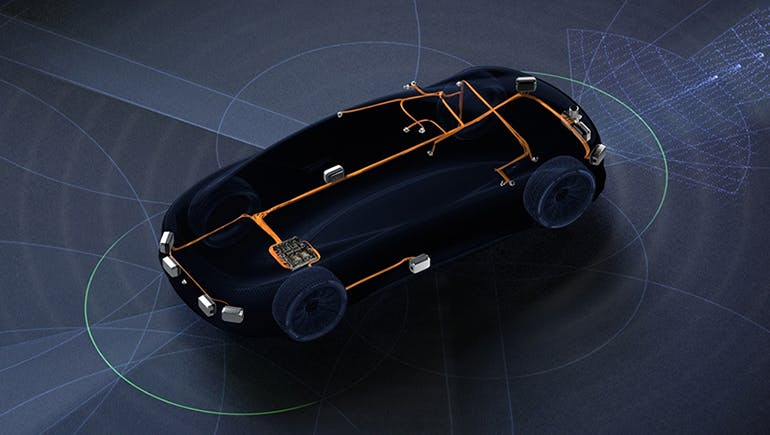

# Vehicle and Sensing Hardware

***

Welcome to the group's repo hub for repos that detail the hardware of our vehicles. Specifically, these repos include codes, diagrams, and CAD models of our vehicles. If there is anything relating to vehicle hardware, you’ll find information about it here. 

***
<!-- TABLE OF CONTENTS -->
# Table of Contents

  
 Click to see/unsee 

  <ol>
    <li>
      <a href="#tagged-hardware-photos">Tagged Hardware Photos</a> 
      Photos and locations for inventoried hardware (for PSU inventory)
    </li>
    <li>
      <a href="#mapping-van-hardware">Mapping Van Hardware</a> 
      This includes information about the mapping van hardware
    </li>
    <li>
      <a href="#p1---the-by-wire-racecar">P1 The by Wire Racecare</a> 
      This includes links to information about the P1 Vehicle
    </li>
    <li>
      <a href="#Hardware vnl300 Steerbywiretractortrailer">Hardware_VNL300_SteerByWireTractorTrailer</a> 
      This includes the hardware information for the Steel by Wire Tractor Trailer    </li>
    <li>
      <a href="#the-wheelchair"> The Wheelchair</a> 
      This includes the information about the autonomous wheelchair </li>
    <li>
      <a href="#the-unmanned-ground-vehicles-ugvs">UGVS</a> 
      This section contains information about our UGVS 
    </li>
    <li>
      <a href="#simulator-hardware-builds">Simulator Hardware Builds</a> 
      This section contains simulation build info </li>
    <li>
      <a href="#ros-install-instructions">ROS Install Instructions</a> 
      This section contains information on installing ROSS </li>
    <li>
      <a href="#real-time-control-architectures">Real Time Control Architectures</a> 
      This section contains information on real time architecture builds 
    </li>
    <li>
      <a href="#real-time-control-software">Real Time Control Software</a> 
      This section contains information on real time architecture softwares
    </li>
    <li>
      <a href="#real-time-control-hardware">Real Time Control Hardware</a> 
      This section contains information on real time architecture Hardware
    </li>
    <li>
      <a href="#camera-calibration">Camera Calibration</a> 
      This section contains information on Jetson hardware implementations
    </li>
    <li>
      <a href="#smart-traffic-cone">Smart Traffic Cone</a> 
      This section contains information on the smart traffic cone work
    </li>
    <li>
      <a href="#microcontrollers">Microcontrollers</a> 
      This section contains information on the microcontrollers in use 
    </li>
    <li>
      <a href="#GPS">GPS</a> 
      This section contains information on the GPS hardware 
    </li>
    <li>
      <a href="#imus">IMUs</a> 
      This section contains information on the IMUs in use 
    </li>
    <li>
      <a href="#encoders">Encoders</a> 
      This section contains information on the encoders in use 
    </li>
    <li>
      <a href="#lidars">LiDARs</a> 
      This section contains information on the LiDARs in use within IVSG. These are general operational and installation instructions. 
    </li>
    <li>
      <a href="#lidars">RADARs</a> 
      This section contains information on the RADARs in use within IVSG. These are general operational and installation instructions. 
    </li>
    <li>
      <a href="#cv2x">CV2x Systems</a> 
      This section contains information on the CV2X units use within IVSG. These are general operational and installation instructions. 
    </li>
    <li>
      <a href="#roadside-equipment-and-work-zone-hardware">Roadside Equipment and Work Zone Hardware</a> 
      This section contains information on signage, equipment, channelizers, etc. typically found adjacent to a road. 
    </li>
  </ol>

<a href="#vehicle-and-sensing-hardware">Back to top</a>

## Tagged Hardware Photos

The following is a list of the PSU-tagged hardware within the IVSG inventory:

 Click to see/unsee 

 <ul>
 Cepton LIDAR sensor_Tag Number 00260911_2025_12_19a
    <li> The Cepton LIDAR sensor
       
      
       
       
      
       
      The Cepton LIDAR sensor is located at the front of the PSU Mapping Van, typically parked at the garage at LTI Transportation Building. Sensor tag Number 00260911. Last inventoried: 2025_12_19.
    </li>
    <li> The Hemisphere S321 GPS sensor
       
      
       
       
      
       
      The Hemisphere S321 GPS sensor is located in Room 109 (storage room) within the Building B of the Transportation Research Institute, typically within the storage safe therein. Sensor tag Number 00253188. Last inventoried: 2025_12_19.
    </li>
    <li> The HRDT Torque Sensor
       
      
       
       
      
       
       
      
       
       
      
       
       
      
       
      The HRDT Torque Sensor is on the gray tractor trailer at the test track. Sensor tag Number 00246726. Last inventoried: 2025_09_12. Previous inventories: 2025_03_21
    </li>
    <li> The Ouster LIDAR sensor
       
      
       
       
      
       
       
      
       
       
      
       
       
      
       
      The Ouster LIDAR sensor is located at the front of the PSU Mapping Van, typically parked at the garage at LTI Transportation Building. Sensor tag Number XXXXXXXX. Last inventoried: 2025_12_19. Unfortunately, the inventory tag was placed onto the mounting surface UNDER the sensor, so it is not visible when the sensor is mounted.
    </li>
    <li> The SICK LMS511 LiDAR sensor
       
      
       
       
      
       
      The The SICK LMS511 LiDAR sensor is located in Dr. Brennan's office, 224 Reber Building or in Room 320 Reber. Sensor tag Number 00240824. Last inventoried: 2025_09_22. Previous Inventories: 2025_03_21.
    </li>
  </ul>

<a href="#vehicle-and-sensing-hardware">Back to top</a>

***

# Mapping van hardware

 Click to see/unsee 

 <ul>
    <li>
      <a href="https://github.com/ivsg-psu/Hardware_MappingVanHardware_CADdrawings/wiki">
     Hardware_MappingVanHardware_CADdrawings
      </a>
       
      These are the CAD drawings currently available for the mapping van, including CADs for individual sensors/actuators listed in other repos.
    </li>
    <li>
      <a href="https://github.com/ivsg-psu/Hardware_MappingVanHardware_LiDAR">
     Hardware_MappingVanHardware_LiDAR
      </a>
       
      This details the LiDAR information that either already exists on mapping van or works as potential options to be purchased.
    </li>
    <li>
      <a href="https://github.com/ivsg-psu/Hardware_MappingVanHardware_Radar">
     Hardware_MappingVanHardware_Radar
      </a>
       
      This details the potential options of Radar to be purchased for mapping van.
    </li>
    <li>
      <a href="https://github.com/ivsg-psu/Hardware_MappingVanHardware_Camera">
    Hardware_MappingVanHardware_Camera
      </a>
       
      This details the information of cameras on mapping van.
    </li>
    <li>
      <a href="https://github.com/ivsg-psu/Hardware_MappingVanHardware_VehicleUsage">    
        Hardware_MappingVanHardware_VehicleUsage
      </a>
       
      This details the vehicle usage info for the mapping van, starting from 2022.
    </li>
  </ul>

<a href="#vehicle-and-sensing-hardware">Back to top</a>

***

# [P1 - the by-wire racecar](http://www.projects.bucknell.edu/Beal_Automotive/)

 Click to see/unsee 

This is a link to the Bucknell site maintained by Dr. Craig Beal with information on the P1 test vehicle.

<a href="#vehicle-and-sensing-hardware">Back to top</a>

# [Hardware_VNL300_SteerByWireTractorTrailer](https://github.com/ivsg-psu/Hardware_VNL300_SteerByWireTractorTrailer/wiki) 

 Click to see/unsee 

Hardware details for our VNL 300 Tractor Trailer system

 
<a href="#vehicle-and-sensing-hardware">Back to top</a>

# The wheelchair

 Click to see/unsee 

 
<a href="#vehicle-and-sensing-hardware">Back to top</a>

# The unmanned ground vehicles (UGVs)

 Click to see/unsee 

<ul>
<li>

<h2> 
<a href="https://github.com/ivsg-psu/Hardware_RCvehicle/wiki">Hardware_RCvehicle </a> - Build details for the RC car build in 2020 </h2>

This is an RC car developed in 2020 to demonstrate RC car sensing, particular for friction estimation and outreach. This wiki was started by Stephen "Steve" Maransky in Summer 2020 as part of his summer intern.  
</li>
</ul>
  
* ## [Clearpath Husky](https://github.com/ivsg-psu/ivsg_master/wiki/Clearpath-Husky)  
* ## [Segway RMP 400](https://github.com/ivsg-psu/ivsg_master/wiki/Segway-RMP-400)  

<a href="#vehicle-and-sensing-hardware">Back to top</a>

# Simulator hardware builds

 Click to see/unsee 

* [Hardware_DrivingSimulator_CockpitBuild](https://github.com/ivsg-psu/Hardware_DrivingSimulator_CockpitBuild/wiki) - Build details for the Driving Simulator cockpit build in 2020
This contains hardware details for the 2020 build of the Driving Simulator cockpit
Hardware details for the 2020 build of the Driving Simulator cockpit. This wiki was started by Emilio Olay as part of his 2020 Summer Internship.

<a href="#vehicle-and-sensing-hardware">Back to top</a>

# ROS install instructions

 Click to see/unsee 

<h2> Versions </h2>
As of 01/2021, the team is switching systems from Ubuntu 16.04 LTS with ROS Kinketic, to Ubuntu 18.04 LTS and ROS Melodic. We're keeping an eye on ROS 2.0 but do not suggest yet that anyone jump into this for project-critical work.

### Install instructions for PCs
1. Begin by downloading the Ubuntu ISO file [Ubuntu 18.04 LTS](http://old-releases.ubuntu.com/releases/18.04.4/)

--Note-- 
Ubuntu 20.04 LTS is available [here](https://ubuntu.com/download/desktop), but 20.04 is not currently used on a group-wide basis

2. There are two options for installing Ubuntu: via [DVD](https://ubuntu.com/tutorials/burn-a-dvd-on-windows#1-overview) or via [USB](https://ubuntu.com/tutorials/create-a-usb-stick-on-windows#1-overview)

Instructions for either DVD install or USB install can be found at the links provided above which redirect you to an Ubuntu.com tutorial.

3. Once a bootable DVD or USB has been created, follow [this](https://ubuntu.com/tutorials/install-ubuntu-desktop#1-overview) installation tutorial

4. Once Ubuntu has successfully been installed, the following instructions from [wiki.ros.org](http://wiki.ros.org/melodic/Installation/Ubuntu) can be used to download ROS melodic.

5. After completing the installation instructions from wiki.ros.org, you have successfully installed ROS melodic!

Supplemental Video Instruction:

The following [video link](https://www.youtube.com/watch?v=9U6GDonGFHw&t=6s) takes you to a youtube guide that provides an introduction to ROS as well as a video run through of the installation process. 

--Note--
This video is a bit dated and runs through the installation process for ROS jade, but the process for installing jade and melodic is very similar

<a href="#vehicle-and-sensing-hardware">Back to top</a>

# Real-time control architectures

 Click to see/unsee 

The group requires real-time performance in many systems (see for example, the work in the Driving Simulator area of this Wiki). There are some good articles on this topic, including topics on:

The XBot Real-Time Software:
* [L. Muratore, A. Laurenzi, E. Mingo Hoffman and N. Tsagarakis, "The XBot Real-Time Software Framework for Robotics: From the Developer to the User Perspective," in IEEE Robotics & Automation Magazine, doi: 10.1109/MRA.2020.2979954](https://ieeexplore.ieee.org/document/9059019)

A key challenge in deciding between architectures to use is ease of use - which leans toward MATLAB and Simulink implementations with Arduino's, versus performance - which leans toward ROS with dedicated real-time platforms and hardware such as GPUs, DSPs, and real-time operating systems. In the past, various members of the group have use a variety of solutions, and their success or failure is useful to study to understand these tradeoffs.

## ROS-based implementations
Most of the PhD students in the team use Robot Operating System.

### Common ROS implementations
The most basic ROS implementation with hardware is to use single or multiple Arduinos, or similar hardware interface devices, to collect data in pseudo-real-time. Pseudo real-time is limited by the time-keeping on the ROS master, which is usually within about 10 ms but is known to delay up to 200 or more ms. Thus, this protocol is useful for simplistic data collection but not for real-time control of systems of bandwidth of 1 Hz or faster. As most of the motor-control and even vehicle position-control systems within the team require faster than 1 Hz plant control, this ROS system approach is not suited for most of the feedback control implementations within the team.

However, it is common that many hardware systems - even Arduinos - can have their hardware-based data collection triggered by a hard real-time source, such as the PPS signal of nearly any GPS device (or up-sampled versions of the same). In this case, ROS is simply acting as a data aggregation service overlaid on the "hard" real-time behavior imposed by the trigger. This is the common method of collecting data, such as is used in the team's mapping van.

### Advanced ROS implementations
More recently, Jesse Pentzer (now with ARL) has been studying the use of ROS 2.0 with DDS (Data Distribution Service - for more information, see [here](https://design.ros2.org/articles/ros_on_dds.html)). The DDS format allows a master-less data-sharing, such that topic discovery for the publish-subscribe process, is distributed rather than coordinated through a central ROS master. 

Jesse's hardware solution for the above is to use a ruggedized fan-less PC computer onboard a robot. Real-time motor control is achieved in the motor controller itself via Roboteq controllers. Jesse has also lately (2020 to 2021) been examining the use of Robotics Technology Kernal (RTK).

<a href="#vehicle-and-sensing-hardware">Back to top</a>

# Real-time Control Software

 Click to see/unsee 

Real-time operating systems guarantee system performance within a given time interval. A [discussion by NASA](https://www.nasa.gov/sites/default/files/482489main_4100_-_RTOS_101.pdf) is useful to understand how these relate to safety and performance. A discussion of RTOSs can be found related to (NASA, here)[https://www.quora.com/What-are-some-Real-Time-Operating-Systems-RTOS-that-NASA-has-used-and-why]. The evolution of RTOS is explained in a neat article by ARSTechnica [here](https://arstechnica.com/features/2020/10/the-space-operating-systems-booting-up-where-no-one-has-gone-before/), which explains VxWorks and the recent open-source movement toward RTEMS.

## Strict practices for real-time control implementations

* [Read the rules for Developing Safety-Critical Code](http://pixelscommander.com/wp-content/uploads/2014/12/P10.pdf) These rules are common practice used in the team, and violating these practices nearly always results in frustration or code breakage later. Learn and follow these rules.

### Learn more

There are wonderful code tools available open-source in [NASA's Code repository](https://code.nasa.gov/?q=real-time). This is a good location to browse for examples and very powerful code tools.

References:
["Control Systems for Computing Systems" in Control Systems Magazine, April 2020](https://ieeexplore.ieee.org/document/9036110)

 
<a href="#vehicle-and-sensing-hardware">Back to top</a>

# Real-time control hardware 

  
 Click to see/unsee 

  <ul>
    <li>
      <a href="https://github.com/ivsg-psu/Hardware_RealTimeHardware_Audesse/wiki">Hardware_RealTimeHardware_Audesse</a>
       
      The master repo for the Audesse (Flexcase) platform real-time hardware implementations.
    </li>
    <li>
      <a href="https://github.com/ivsg-psu/Hardware_RealTimeHardware_Jetsons/wiki">Hardware_RealTimeHardware_Jetsons</a>
       
      The master repo for Jetson real-time hardware implementations.
    </li>
    <li>
      <a href="https://github.com/ivsg-psu/Hardware_RealTimeHardware_RaspberryPi_MATLABandSimulink/wiki">Hardware_RealTimeHardware_RaspberryPi_MATLABandSimulink</a>
       
      This is a how-to guide to setup MATLAB and Simulink on the Raspberry Pi series of microprocessors.
    </li>
  </ul>

<a href="#vehicle-and-sensing-hardware">Back to top</a>

# Camera Calibration

 Click to see/unsee 

<ul>
<li>
<a href="https://github.com/ivsg-psu/ivsg_master/tree/master/CameraCalibration_wiki">Camera Calibration</a>
 
The master repo for all things camera calibration.

<a href="#vehicle-and-sensing-hardware">Back to top</a>

</ul>
</li>

# Smart Traffic cone 

 Click to see/unsee 

  <ul>
    <li>
      <a href="https://github.com/ivsg-psu/Hardware_SmartTrafficCone_BluetoothSetupCode">
      Hardware_SmartTrafficCone_BluetoothSetupCode
      </a>
       
      Information and resources for setting up bluetooth for a smart traffic cone.
    </li>
    <li>
      <a href="https://github.com/ivsg-psu/Hardware_SmartTrafficCone_EventDetection">
      Hardware_SmartTrafficCone_EventDetection
      </a>
       
      This details the code used to detect whether an event occurs to a smart traffic cone.
    </li>

  </ul>

 
<a href="#vehicle-and-sensing-hardware">Back to top</a>

# Microcontrollers 

 Click to see/unsee 

<h3> Arduino </h3>
  <ul>
    <li>
      <a href="https://github.com/ivsg-psu/Hardware_Microcontrollers_Arduino_SPICommunicationFlow/wiki">
      Hardware_Microcontrollers_Arduino_SPICommunicationFlow
      </a>
       
      Code to accomplish one-way and two-way SPI communication between two Arduino Unos, specifically sending floating-point variables.
    </li>
  </ul>
<h3> Teensy </h3>
  <ul>
    <li>
      <a href="https://github.com/ivsg-psu/Hardware_Microcontrollers_Teensy_ReadingAndWritingToFlashMemory">
      Hardware_Microcontrollers_Teensy_ReadingAndWritingToFlashMemory
      </a>
       
      Code for reading and writing to flash memory on Teensy 4.1.
    </li>
    <li>
      <a href="https://github.com/ivsg-psu/Hardware_Microcontrollers_Teensy_ReadingAndWritingToSDCard/wiki">
      Hardware_Microcontrollers_Teensy_ReadingAndWritingToSDCard
      </a>
       
      Code for reading and writing to an SD card with Teensy 4.1.
    </li>
    <li>
      <a href="https://github.com/ivsg-psu/FieldDataCollection_TypicalHardwareSetups_EncoderCodes_ReadingEncodersWithTeensy">
      FieldDataCollection_TypicalHardwareSetups_EncoderCodes_ReadingEncodersWithTeensy
      </a>
       
      A repo for the Teensy 4.1 code that is used to measure counts from a high resolution US Digital Encoder.
    </li>
    <li>
      <a href="https://github.com/ivsg-psu/Hardware_IMUs_ReadingLSM6DS3IMUWithTeensy/wiki">
      Hardware_IMUs_ReadingLSM6DS3IMUWithTeensy
      </a>
       
      Code for interfacing with the low-cost LSM6DS3 IMU from SparkFun using the Teensy microcontroller.
    </li>
    <li>
      <a href="https://github.com/ivsg-psu/FieldDataCollection_TypicalHardwareSetups_EncoderCodes_ReadingEncodersWithTeensy">
      FieldDataCollection_TypicalHardwareSetups_EncoderCodes_ReadingEncodersWithTeensy
      </a>
       
      A repo for the Teensy 4.1 code that is used to measure counts from a high resolution US Digital Encoder.
    </li>
    <li>
      <a href="https://github.com/ivsg-psu/Hardware_Microcontrollers_Teensy_UDPCommunicationBasicExample/wiki">
      Hardware_Microcontrollers_Teensy_UDPCommunicationBasicExample
      </a>
       
      A repo for the Teensy 4.1 code that shows how to send and receive a simple string via UDP across a local network.
    </li>
  </ul>

<a href="#vehicle-and-sensing-hardware">Back to top</a>

# GPS

 Click to see/unsee 

  <ul>
    <li>
      <a href="https://github.com/ivsg-psu/Hardware_GPS_NovatelGPSAndIMU/wiki">
      Hardware_GPS_NovatelGPSAndIMU
      </a>
       
      Purchase and hardware information for the Novatel HG1700 IMU with Span receivers.
    </li>
    <li>
      <a href="https://github.com/ivsg-psu/Hardware_GPS_CorrsysDatronGPSandIMU">
      Hardware_GPS_CorrsysDatronGPSandIMU
      </a>
       
      Information on the team's Corrsys Datron GPS with integrated IMU. (in progress)
    </li>
    <li>
      <a href="https://github.com/ivsg-psu/Hardware_GPS_BaseStationMounting">
      Hardware_GPS_BaseStationMounting
      </a>
       
      Information on how to physically install a DGPS base station (hardware setup only - see below for setup of RTK software). 
    </li>
    <li>
      <a href="https://github.com/ivsg-psu/FieldDataCollection_GPSRelatedCodes_RTKCorrectionService">
      FieldDataCollection_GPSRelatedCodes_RTKCorrectionService
      </a>
       
      Information on software related to RTK setup of DGPS base station. 
    </li>

  </ul>

<a href="#vehicle-and-sensing-hardware">Back to top</a>

# IMUs

 Click to see/unsee 

  <ul>
    <li>
      <a href="https://github.com/ivsg-psu/Hardware_IMUs_ReadingLSM6DS3IMUWithTeensy/wiki">
      Hardware_IMUs_ReadingLSM6DS3IMUWithTeensy
      </a>
       
      Code for interfacing with the low-cost LSM6DS3 IMU from SparkFun using the Teensy microcontroller.
    </li>
    <li>
      <a href="https://github.com/ivsg-psu/Hardware_GPS_NovatelGPSAndIMU/wiki">
      Hardware_GPS_NovatelGPSAndIMU
      </a>
       
      Purchase and hardware information for the Novatel HG1700 IMU with Span receivers.
    </li>

  </ul>

<a href="#vehicle-and-sensing-hardware">Back to top</a>

# Encoders

 Click to see/unsee 

  <ul>
    <li>
      <a href="https://github.com/ivsg-psu/FieldDataCollection_TypicalHardwareSetups_EncoderCodes_ReadingEncodersWithTeensy">
      FieldDataCollection_TypicalHardwareSetups_EncoderCodes_ReadingEncodersWithTeensy
      </a>
       
      A repo for the Teensy 4.1 code that is used to measure counts from a high resolution US Digital Encoder.
    </li>

  </ul>

<a href="#vehicle-and-sensing-hardware">Back to top</a>

# LiDARs

 Click to see/unsee 

  <ul>
    <li>
      <a href="https://github.com/ivsg-psu/FieldDataCollection_TypicalHardwareSetups_LIDARs_VelodyneVLP16Install/wiki">
      FieldDataCollection_TypicalHardwareSetups_LIDARs_VelodyneVLP16Install
      </a>
       
      A repo for the installation process (software) for the Velodyne VLP 16 LiDAR, and to confirm it is working.
    </li>
    <li>
      <a href="https://github.com/ivsg-psu/FieldDataCollection_TypicalHardwareSetups_LIDARs_CeptonX90Install/wiki">
      FieldDataCollection_TypicalHardwareSetups_LIDARs_CeptonX90Install
      </a>
       
      A repo for the installation process (software) for the Cepton X90 solid state LiDAR, and to confirm it is working.
    </li>

  </ul>

<a href="#vehicle-and-sensing-hardware">Back to top</a>

# RADARs

 Click to see/unsee 

  <ul>
    <li>
      <a href="https://github.com/ivsg-psu/Hardware_RADARs_DelphiESR/wiki">
      Hardware_RADARs_DelphiESR
      </a>
       
      A repo for the installation process (software) for the Delphi ESR RADAR unit, 
    </li>
  </ul>

<a href="#vehicle-and-sensing-hardware">Back to top</a>

# CV2X

 Click to see/unsee 

  <ul>
    <li>
      <a href="https://github.com/ivsg-psu/Hardware_CV2X_Commsignia/wiki">
      Hardware_CV2X_Commsignia
      </a>
       
      The repo for the install instructions for the Commsignia RSUs and OBUs. NOTE: this is a Proprietary Repo and requires NDA to access. 
    </li>
  </ul>

<a href="#vehicle-and-sensing-hardware">Back to top</a>

# Roadside Equipment and Work Zone Hardware

 Click to see/unsee 

  <ul>
    <li>
      <a href="https://github.com/ivsg-psu/Hardware_WorkZones_PennsylvaniaADSEquipmentInventory">
      Hardware_WorkZones_PennsylvaniaADSEquipmentInventory
      </a>
       
      The work zone artifact inventory for the PA ADS grant work. 
    </li>
  </ul>

<a href="#vehicle-and-sensing-hardware">Back to top</a>

# Publications

***
Welcome to the IVSG hub for repos related to our publications. Specifically, this area hosts the repos that can be publicly shared so that the results of publications can be replicated. Data for each publication should be found under the mirror area for repos on the IVSG OneDrive area, as well as in the Publications folder for that publication.

<!-- TABLE OF CONTENTS -->
## Table of Contents

  
 Click to see/unsee 

  <ol>
    <li>
      <a href="#theses">Theses</a>
      These are repos for thesis codes, organized by year. Note: these are usually links to true (non-publication) repos.
    </li>
    <li>
      <a href="#journals">Journal Publications</a>
      These are repos for Journal publications, organized by year.
    </li>
    <li>
      <a href="#conferences">Conference Publications</a>
      These are repos for Conference publications, organized by year.
    </li>
    <li>
      <a href="#reports">Reports</a>
      These are repos for Reports and sponsor-specific publications, organized by year.
    </li>
  </ol>

<a href="#publications">Back to top</a>

***

## Theses

<!-- THESES -->

  
 Click to see/unsee 

  <ul>
    2022
    <li>
      <a href="https://github.com/ivsg-psu/FieldDataCollection_SafetyProcedures_AutonomousRobotTestingProcedureOrdering/wiki">
      FieldDataCollection_SafetyProcedures_AutonomousRobotTestingProcedureOrdering
      </a>
       
      This is code demonstrating MATLAB map plotting, as well as an ability to do synchronized pan and zoom across the figures.
    </li>
  </ul>

<a href="#publications">Back to top</a>

***

## Journals

<!-- JOURNALS -->

  
 Click to see/unsee 

  <ul>
  2022
    <li>
      <a href="https://github.com/ivsg-psu/Publications_Journals_2022RSS/wiki">
      Publications_Journals_2022RSS
      </a>
      This is code for the 2022 RSS Journal submission on friction patches.
    </li>
  2025
    <li>
      <a href="https://github.com/ivsg-psu/Publications_Journals_2025_JAVS_Cao_ExtrinsicCalibration">
      Publications_Journals_2025_JAVS_Cao_ExtrinsicCalibration
      </a>
      This is code for the 2025 Journal of Autonomous Vehicles and Systems Journal submission on extrinsic calibration using LIDAR targets, with Xinyu Cao as lead author.
    </li>
  </ul>

<a href="#publications">Back to top</a>

***

## Conferences

<!-- CONFERENCES -->

  
 Click to see/unsee 

  2022
  <ul>
    <li>
      <a href="https://github.com/ivsg-psu/Publications_Conferences_2022RSS/wiki">
      Publications_Conferences_2022RSS
      </a>
      This is code for the 2022 RSS conference paper submission on friction patches.
    </li>
  </ul>
  2023
  <ul>
    <li>
      <a href="https://github.com/ivsg-psu/Publications_Conferences_2023CCTA_RoadNetworkFrictionAnalysis">
      Publications_Conferences_2023CCTA_RoadNetworkFrictionAnalysis
      </a>
      This is code for the 2023 IEEE Conference on Control Technology Applications, for Juliette Mitrovich's paper analyzing friction on the State College road network.
    </li>
    <li>
      <a href="https://github.com/ivsg-psu/Publications_Conferences_2023CCTA_FeasibleVehicleTrajectories-">
      Publications_Conferences_2023CCTA_FeasibleVehicleTrajectories
      </a>
      This is code for the 2023 IEEE Conference on Control Technology Applications, for Juliette Mitrovich's paper  synthesizing feasible vehicle trajectories from microscopic traffic simulations.
    </li>
  </ul>
  2024
  <ul>
  </ul>
  2025
  <ul>
    <li>
      <a href="https://github.com/ivsg-psu/Publications_Conferences_2025MECC_VgraphCorridor">
      Publications_Conferences_2025MECC_VgraphCorridor
      </a>
      This is code for the 2025 Modeling, Estimation, and Control Conference in Pittsburg, PA, for Steve Harnett's paper on using visibility graphs to estimate corridor widths for path planning.
    </li>
    <li>
      <a href="https://github.com/ivsg-psu/Publications_Conferences_2025MECC_CV2XPerformanceInWorkZones">
      Publications_Conferences_2025MECC_CV2XPerformanceInWorkZones
      </a>
      This is code for the 2025 Modeling, Estimation, and Control Conference in Pittsburg, PA, for Yao Sun's paper on measuring CV2X coverage in work zones.
    </li>
  </ul>

<a href="#publications">Back to top</a>

***

## Reports

<!-- REPORTS -->

  
 Click to see/unsee 

  <ul>
  </ul>

<a href="#publications">Back to top</a>
